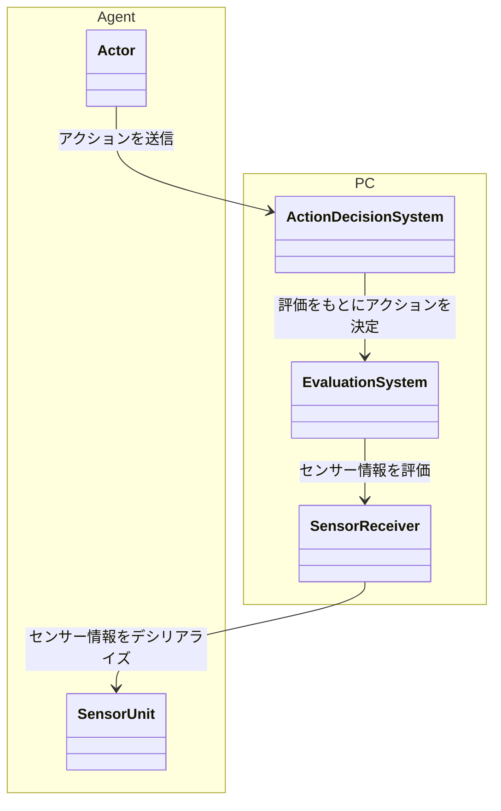

# weak-toio 概要設計 <!-- omit in toc -->

本稿では、「weak-toio」の概要設計について述べる。詳細については各コンポーネントのドキュメントを参照すること。

## 目次 <!-- omit in toc -->

1. [全体フロー](#全体フロー)
	1. [Agent 部](#agent-部)
	2. [PC 部](#pc-部)
2. [Agent 部](#agent-部-1)
	1. [Actor 部](#actor-部)
	2. [Sensor 部](#sensor-部)

## 全体フロー

### Agent 部

ハードウェア部分。
アクションを実行するアクター部、環境データを取得するセンサー部からなる。

### PC 部

PC 側の処理部分。
センサー部から送られた情報をもとに、環境の評価を行い、評価を元にアクター部の行動を決定する。

## Agent 部

Agent 部はアクター部とセンサー部からなる。ハードウェアは、アクター部には toio を、センサー部には M5StickC を用いる。

### Actor 部

PC 部と通信して行動命令を受け取り、アクションを実行する。

### Sensor 部

センサーを用いて環境情報を取得し、シリアル通信を用いて PC 部にデータを送信する。
