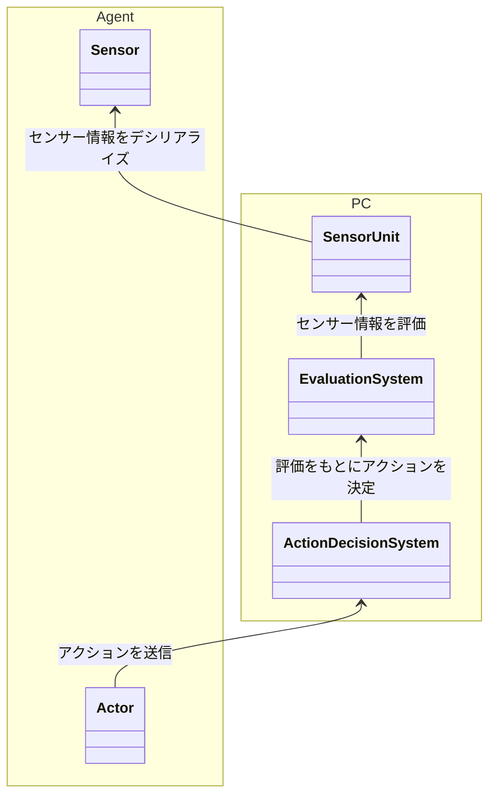
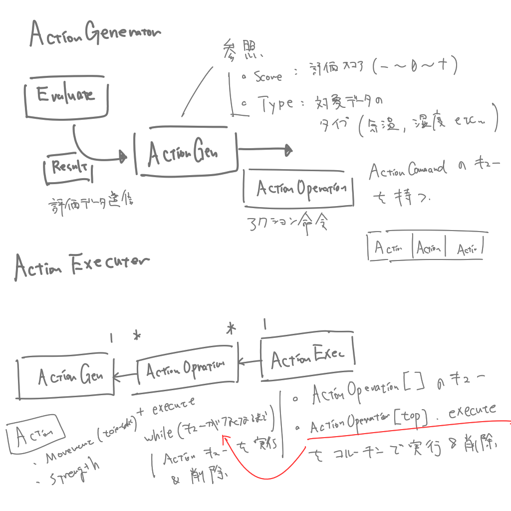

# weak-toio 概要設計 <!-- omit in toc -->

本稿では、「weak-toio」の概要設計について述べる。詳細については各コンポーネントのドキュメントを参照すること。

## 目次 <!-- omit in toc -->

1. [1. 全体フロー](#1-全体フロー)
	1. [1.1. Agent 部](#11-agent-部)
	2. [1.2. PC 部](#12-pc-部)
2. [2. Agent 部](#2-agent-部)
	1. [2.1. Actor 部](#21-actor-部)
	2. [2.2. Sensor 部](#22-sensor-部)
3. [3. PC 部](#3-pc-部)
	1. [3.1. SensorUnit](#31-sensorunit)
	2. [3.2. EvaluationSystem](#32-evaluationsystem)
	3. [3.3. ActionDecisionSystem](#33-actiondecisionsystem)
4. [SensorUnit](#sensorunit)
	1. [M5DataReceiver](#m5datareceiver)
	2. [DummyDataGenerator](#dummydatagenerator)

## 1. 全体フロー

### 1.1. Agent 部

ハードウェア部分。
アクションを実行するアクター部、環境データを取得するセンサー部からなる。

### 1.2. PC 部

PC 側の処理部分。
センサー部から送られた情報をもとに、環境の評価を行い、評価を元にアクター部の行動を決定する。

## 2. Agent 部

Agent 部はアクター部とセンサー部からなる。ハードウェアは、アクター部には toio を、センサー部には M5StickC を用いる。

### 2.1. Actor 部

PC 部と通信して行動命令を受け取り、アクションを実行する。

### 2.2. Sensor 部

センサーを用いて環境情報を取得し、シリアル通信を用いて PC 部にデータを送信する。

## 3. PC 部

PC 部では、Agent 部から送られたシリアルデータをもとに、現在の環境への評価を行う。シリアルデータは string として送られ、デシリアライズしたのち、評価結果を int で取得する。評価結果をもとに Actor のアクションを決定し、toio-sdk の API を通して現実世界の Actor へアクション命令を送信する。

### 3.1. SensorUnit

Sensor から送られたシリアルデータをデシリアライズし、もとの環境データとして保持する。

### 3.2. EvaluationSystem

環境データを評価し、整数値で評価スコアを返す。

評価スコアは 0 を適正値として、正負に傾きすぎることで環境の過不足を表現する。

### 3.3. ActionDecisionSystem

評価スコアをもとに、Actor に行わせるアクションを決定する。

ActionDecisionSystem はアクション生成部とアクション処理部からなる。アクション生成部では、評価スコアおよび対象としている環境に合わせて異なるアクション命令を逐次発行し、アクション処理部に送信する。アクション処理部では、送られたアクション命令をキューで管理し、古い命令から順に処理していく。

アクション命令には force, normal の 2 つの強度があり。force の命令が追加された場合、それまで保持していたキューをすべて削除し、最新の force 命令を実行する。force 命令が複数追加された場合、アクション処理部はコンソールから警告を出し、それまでのキューを削除した後、最新の force 命令を実行する。

## SensorUnit

Sensor から送信されたシリアルデータをデシリアライズして、自身のフィールドに保存する。

Sensor と SensorUnit のフィールドは漏れなく対応づいている必要がある。

センサー情報を集約した SensorInfo 構造体を作成し、その中に保持する。各フィールドはプロパティを作成し、SensorUnit -> SensorInfo と経由して、値を取得可能にする。

SensorUnit は PC 側でセンサー情報を取り扱う抽象クラスであり、Sensor 側のハードウェアやダミーデータなどの必要に合わせて、必要なデータおよび機能を持った具象クラスを作成する。

-   Update(): public void
    シリアルデータを受け取り、フィールドを更新する。具象クラスでの実装を必須とする。

### M5DataReceiver

今回使用する Sensor のハードウェアである、M5StickC からのシリアルデータを保持するクラス。SensorUnit 継承クラス。

M5DataReceiver が保持するフィールドは次のようになっている。

| フィールド名 | 単位   | 説明                                               | データ型 |
| ------------ | ------ | -------------------------------------------------- | -------- |
| deviceName   | -      | デバイス名                                         | String   |
| acceleration | cm/m^2 | 加速度。x,y,z の 3 軸を保持。                      | Vector3  |
| gyro         | rad/s  | 角速度。x, y,z の 3 軸を保持。                     | Vector3  |
| temp         | ℃      | 気温。ENV.2 ユニットを使用して取得。               | float    |
| humidity     | %      | 湿度                                               | float    |
| pressure     | Pa     | 気圧                                               | float    |
| vbat         | V      | バッテリー電圧。充電量を計算するのに使えるらしい。 | float    |

### DummyDataGenerator

M5DataReceiver はハードウェアとの通信が必要なため、毎度接続して取得してとやるのが面倒。そのため PC 部のシステムをテストする用にダミーデータ生成器を作成した。M5DataReceiver 継承クラス。

フィールドは M5DataReceiver と同じもの。

-   Update(): public void
    ダミーデータを生成してフィールドに格納する。
-   GenerateDummyData: public void
    Update()で呼び出すダミーデータ生成関数。Random などの乱数生成機能を用いて実装する。
