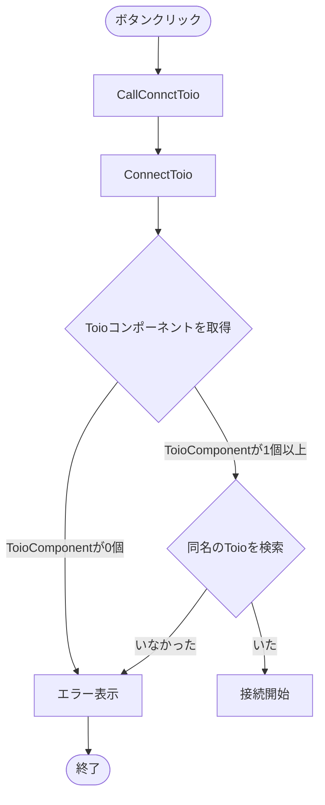

# ToioConnecter.ConnectToio

`CubeScanner`，`CubeConnecter`を使って toio に接続する非同期処理．
Unity 上の toio と実機 toio のローカルネームを照合して，同名のものを接続する．

```mermaid
 graph TD
  Start([ボタンクリック]) --> CallConnctToio
  CallConnctToio --> ConnectToio
  ConnectToio --> GetToioComponets{Toioコンポーネントを取得}
  GetToioComponets --> |ToioComponentが0個| Error[エラー表示]
  Error --> End([終了])
  GetToioComponets --> |ToioComponentが1個以上| Find{同名のToioを検索}
  Find --> |いた| StartConnect[接続開始]
  Find --> |いなかった| Error
```
