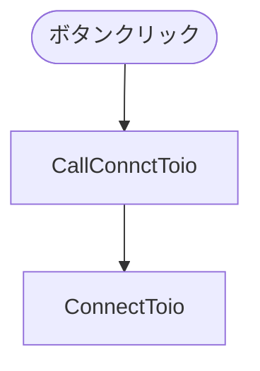

# ToioConnecter.ConnectToio

`CubeScanner`，`CubeConnecter`を使って toio に接続する非同期処理．
Unity上のtoioと実機toioのローカルネームを照合して，同名のものを接続する．

```mermaid
 graph TD
  Start([ボタンクリック]) --> CallConnctToio
  CallConnctToio --> ConnectToio
  
```
