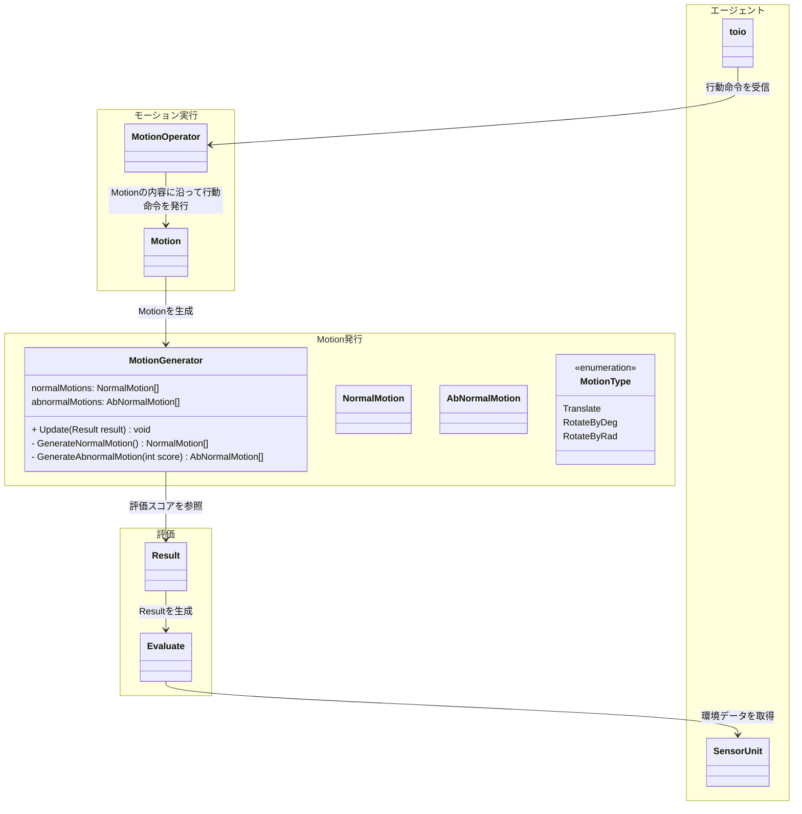

```mermaid
classDiagram
	namespace Motion発行{
		class MotionGenerator{
		 	normalMotions: NormalMotion[]
			abnormalMotions: AbNormalMotion[]
			+ Update(Result result) void
			- GenerateNormalMotion() NormalMotion[]
			- GenerateAbnormalMotion(int score) AbNormalMotion[]
		}
		class NormalMotion{

		}
		class AbNormalMotion{

		}
		class Motion{

		}
		class MotionType{
			<<enumeration>>
			Translate
			RotateByDeg
			RotateByRad
		}
	}
	namespace 評価{
		class Evaluate
		class Result
	}
	namespace エージェント{
		class toio
		class SensorUnit
	}
	namespace モーション実行{
		class MotionOperator
		class Motion
	}

	Evaluate --> SensorUnit: 環境データを取得
	Result --> Evaluate: Resultを生成
	MotionGenerator --> Result: 評価スコアを参照
	Motion --> MotionGenerator: Motionを生成
	MotionOperator --> Motion: Motionの内容に沿って行動命令を発行
	toio --> MotionOperator: 行動命令を受信
```
