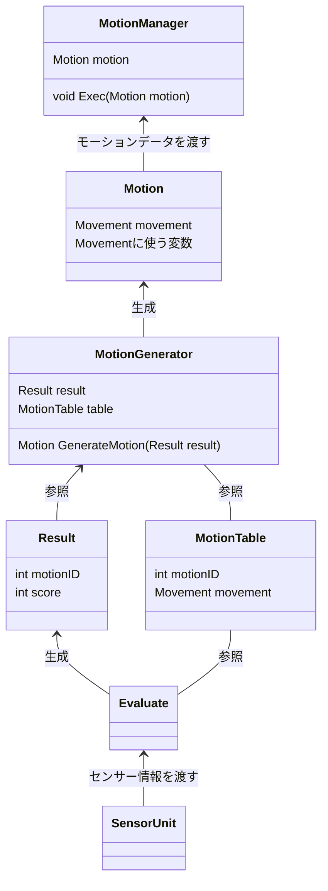

```mermaid
classDiagram
	class MotionManager{
		Motion motion
		void Exec(Motion motion)
	}
	class MotionGenerator{
			Result result
			MotionTable table
			Motion GenerateMotion(Result result)
	}
	class Motion{
		Movement movement
		Movementに使う変数
	}
	class Result{
		int motionID
		int score
	}
	class MotionTable{
		int motionID
		Movement movement
	}
	MotionManager <-- Motion : モーションデータを渡す
	Motion <-- MotionGenerator : 生成
	Result <-- Evaluate : 生成
	MotionTable -- Evaluate : 参照
	MotionGenerator <-- Result : 参照
	Evaluate <-- SensorUnit : センサー情報を渡す
	MotionGenerator -- MotionTable : 参照
```
